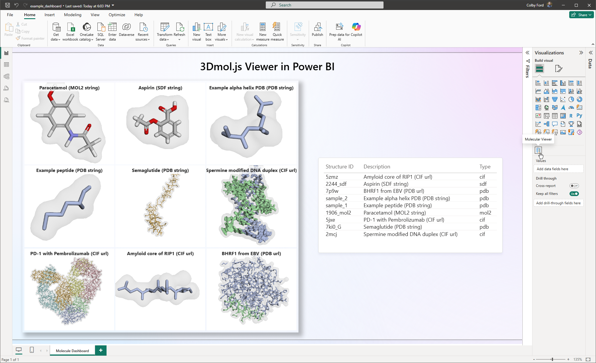

# Molecule Viewer - Power BI Custom Visual 📊🧬

A Power BI custom visual that allows users to visualize molecular structure data using the 3Dmol.js viewer.

<h3 align="right">Colby T. Ford, Ph.D. | Tuple, LLC</h3>

<!--  -->


## Features

- **Multiple format support**: Load structures in PDB, CIF, MOL2, SDF, XYZ, or Cube format
- **File path support**: Load structures from URLs or file paths
- **Small Multiples Support**: Display multiple structures in a grid layout with configurable title positions
- **Multiple visualization styles**: Choose from Cartoon, Stick, Line, Cross, Sphere, and Surface representations
- **Flexible coloring schemes**: Color by Chain, Residue, Spectrum, Secondary Structure, or use default colors
- **Custom chain colors**: Define specific colors for chains A thru F directly in Display Settings
- **Surface overlay**: Add translucent molecular surfaces with independent color control including custom colors
- **Customizable display**: Adjust background color, enable auto-rotation, and configure grid layout
- **Automatic format detection**: Automatically detects structure format (PDB, CIF, etc.)

## Installation

1. Download the latest `.pbiviz` file from the `dist/` directory
2. In Power BI Desktop, go to **Visualizations** pane
3. Click the **...** (More options) button and select **Import a visual from a file**
4. Select the downloaded `.pbiviz` file
5. The 3Dmol Protein Viewer will appear in your visualizations pane

## Usage

### Data Requirements

The visual expects a column containing molecular structure data as text strings OR file paths/URLs to structure files. The visual automatically detects whether the value is a URL or structure data. Multiple rows will be displayed as a grid of structures.

1. Add the visual to your report canvas
2. Drag a field containing structure data (string or URL) to the **Structure Data** data role
3. Optionally, drag a field containing molecule names to the **Title** data role
4. The structure(s) will be rendered automatically in a grid layout

### Supported Formats

- **PDB** - Protein Data Bank format
- **CIF** - Crystallographic Information File (mmCIF)
- **MOL2** - Tripos MOL2 format
- **SDF** - Structure Data File
- **XYZ** - XYZ coordinate format
- **Cube** - Gaussian Cube format

### Formatting Options

Access these settings in the Format pane:

#### Display Settings
- **Protein Style**: Choose how the structure is rendered (Cartoon, Stick, Line, Cross, Sphere, Surface)
- **Color Scheme**: Select coloring method (By Chain, By Residue, Spectrum, Secondary Structure, Default)
- **Background Color**: Set the viewer background color
- **Auto Rotate**: Enable/disable automatic rotation of the structure
- **Use Custom Chain Colors**: Enable custom coloring for individual chains
- **Chain A/B/C/D/E/F Color**: Color pickers to set specific colors for each chain

#### Grid Settings
- **Columns**: Number of columns in the grid (set to 0 for automatic layout based on the number of structures)
- **Show Titles**: Enable/disable display of molecule titles
- **Title Position**: Choose where titles appear in each cell (Top Left, Top Center, Top Right, Bottom Left, Bottom Center, Bottom Right)

#### Surface Settings
- **Show Surface**: Toggle to overlay a translucent molecular surface on the structure
- **Surface Opacity**: Adjust the transparency of the surface (0-100%)
- **Surface Color Scheme**: Select coloring method for the surface (By Chain, By Residue, Spectrum, Secondary Structure, Custom Color, Default)
- **Surface Color**: Custom color picker for the surface (when Color Scheme is Custom)

## Development

### Prerequisites

- Node.js (v12 or higher)
- npm
- Power BI Visual Tools: `npm install -g powerbi-visuals-tools`

### Building from Source

```bash
# Install dependencies
npm install

# Start development server
npm start

# Package the visual
npm run package
```

The packaged visual will be available in the `dist/` directory.

## Dependencies

- [3Dmol.js](https://3dmol.csb.pitt.edu/) - Molecular visualization library
- Power BI Visuals API
